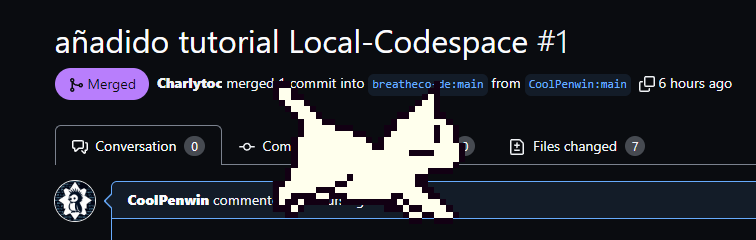
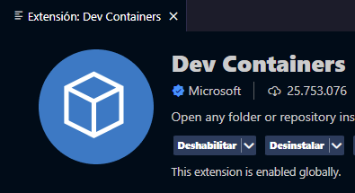
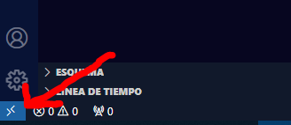
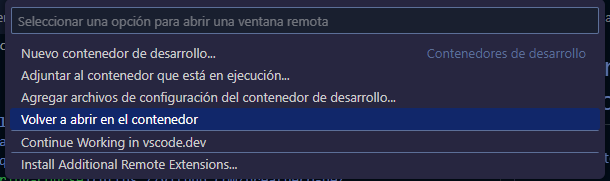

# Bienvenido al curso práctico Crear tu propio "Local Codespace" 🤖

En este curso aprenderás a crear un entorno de desarrollo local utilizando Docker, lo que te permitirá trabajar de manera eficiente y reproducible sin depender de un Codespace en la nube.

### En este curso respondemos las siguientes preguntas:
- ¿Cómo inicio LearnPack en local?
- El Codespace está fallando, ¿qué hago?
- Quiero hacer [Prompt-Engineering-Course](https://github.com/breatheco-de/prompt-engineering-exercise-course) y están deshabilitados los Codespace, ¿no puedo hacer el curso?
- ¿Tienes un pésimo Internet y necesitas trabajar?
- ¿Cansado de decir "Pues en mi PC funciona"?

### La Solución: Crear un Contenedor Virtual en Local usando Docker



## **Requisitos Previos**

Asegúrate de tener instalados y abiertos:
- [Visual Studio Code](https://code.visualstudio.com/)
- La extensión de [Dev Containers](https://marketplace.visualstudio.com/items?itemName=ms-vscode-remote.remote-containers) en VSCode



- [Docker Desktop](https://www.docker.com/products/docker-desktop/)
  > Posiblemente necesites registrarte para usar Docker.
  > Recuerda tener abierto Docker Desktop.

## **Pasos para Configurar el Entorno de Desarrollo Local**

### 1. Clona Localmente el Repositorio del Curso
En la Terminal ejecuta:
```bash
git clone url-del-repositorio
```
> Reemplaza `url-del-repositorio` con la URL real del repositorio del curso.

### 2. Abre el Contenedor de Desarrollo en VSCode
- En VSCode, haz clic en el icono de `><` en la esquina inferior izquierda.



- Selecciona `Reopen in Container`.



### 3. Espera a que se Configure el Contenedor
En la Terminal pasarán cosas, ¡Don't-Panic!
> La primera vez tarda bastante, aproximadamente 10 minutos.

### 4. Inicia el Contenedor en Docker
Inicia el nuevo contenedor que aparecerá en Docker Desktop.

### 5. Inicia LearnPack Automáticamente
LearnPack se iniciará automáticamente.
> Tenemos la opción de lanzarlo en el navegador.

## **Recursos Adicionales**

### ¿Qué es Docker y por qué es necesario?
Docker es una plataforma que permite crear, desplegar y ejecutar aplicaciones en contenedores. Los contenedores permiten a los desarrolladores empaquetar una aplicación con todas sus dependencias y configuraciones, asegurando que funcione de manera consistente en cualquier entorno. Para este curso, Docker nos permite crear un entorno de desarrollo aislado y reproducible.

- [Documentación de Docker](https://docs.docker.com/get-started/)
- [Documentación de Visual Studio Code](https://code.visualstudio.com/docs)
- [Documentación de Dev Containers](https://code.visualstudio.com/docs/remote/containers)

---

Este tutorial ha sido desarrollado por el alumno [CoolPenwin](https://github.com/CoolPenwin)

¿Te gustaría añadir algo más o modificar alguna parte de estas instrucciones?
