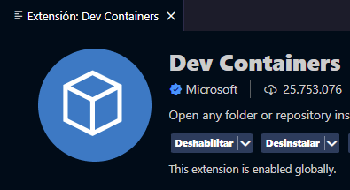
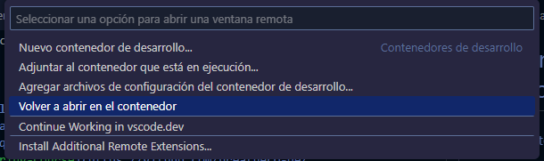

# Welcome to the practical course "Create your own Local Codespace" 🤖

In this course, you will learn how to create a local development environment using Docker, allowing you to work efficiently and reproducibly without relying on a cloud-based Codespace.

### In this course, we answer the following questions:
- How do I start LearnPack locally?
- The Codespace is failing, what do I do?
- I want to take the [Prompt-Engineering-Course](https://github.com/breatheco-de/prompt-engineering-exercise-course) but Codespaces are disabled, can't I take the course?
- Do you have poor internet and need to work?
- Tired of saying "Well, it works on my PC"?

### The Solution: Create a Local Virtual Container using Docker

## **Prerequisites**

Make sure you have installed and opened:
- [Visual Studio Code](https://code.visualstudio.com/)
- The [Dev Containers](https://marketplace.visualstudio.com/items?itemName=ms-vscode-remote.remote-containers) extension in VSCode



- [Docker Desktop](https://www.docker.com/products/docker-desktop/)
  > You may need to register to use Docker.
  > Remember to have Docker Desktop open.

## **Steps to Set Up the Local Development Environment**

### 1. Clone the Course Repository Locally
In the Terminal, run:
```bash
git clone repository-url
```
> Replace `repository-url` with the actual URL of the course repository.

### 2. Open the Development Container in VSCode
- In VSCode, click on the `><` icon in the bottom left corner.


- Select `Reopen in Container`.



### 3. Wait for the Container to Configure
Things will happen in the Terminal, Don't-Panic!
> The first time it takes quite a while, approximately 10 minutes.

### 4. Start the Container in Docker
Start the new container that will appear in Docker Desktop.

### 5. LearnPack Starts Automatically
LearnPack will start automatically.
> We have the option to launch it in the browser.

## **Additional Resources**

### What is Docker and why is it necessary?
Docker is a platform that allows you to create, deploy, and run applications in containers. Containers enable developers to package an application with all its dependencies and configurations, ensuring it runs consistently in any environment. For this course, Docker allows us to create an isolated and reproducible development environment.

- [Docker Documentation](https://docs.docker.com/get-started/)
- [Visual Studio Code Documentation](https://code.visualstudio.com/docs)
- [Dev Containers Documentation](https://code.visualstudio.com/docs/remote/containers)

---

This tutorial was developed by the student [CoolPenwin](https://github.com/CoolPenwin)

Would you like to add anything else or modify any part of these instructions?
